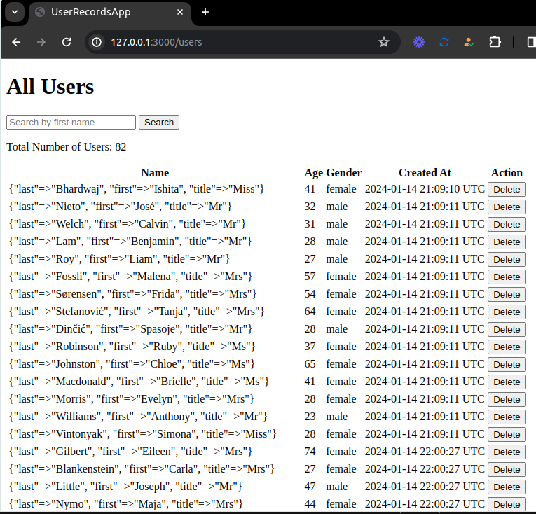

# User Records App

This project is build on the Ruby on Rails. It's primary focus is to fetch the data from an API and add that data into the database in particular interval of time as a background job without interrupting UI or slowing down website. 
      

<div align="center">

[](https://github.com/Dipeshtwis/user-records-app)
[](https://github.com/Dipeshtwis/user-records-app/issues)
[](https://github.com/Dipeshtwis/user-records-app/pulls)

</div>

## 📝 Contents

<p align="center">
<a href="#with">Built with</a>&nbsp;&nbsp;&nbsp;|&nbsp;&nbsp;&nbsp;
<a href="#sc">Screenshot</a>&nbsp;&nbsp;&nbsp;|&nbsp;&nbsp;&nbsp;
<a href="#ll">Live Demo Link</a>&nbsp;&nbsp;&nbsp;|&nbsp;&nbsp;&nbsp;
<a href="#gs">Getting started</a>&nbsp;&nbsp;&nbsp;|&nbsp;&nbsp;&nbsp;
<a href="#author">Author</a>
</p>

## 🔧 Built with<a name = "with"></a>

- Ruby on Rails (Version: 7.1)
- Ruby (Version: 3.3.0)
- Postgresql (version: 14.10)
- Sidekiq (version: 6.5.12)
- Redis

## Screenshot <a name = "sc"></a>

### Home Page



### Daily Record Report


## Live Demo Link <a name = "ll"></a>

Not Yet


## Getting Started <a name = "gs"></a>

To get a local copy of the repository please run the following commands on your terminal:

```
$ cd <folder>
```

~~~bash
$ git clone git@github.com:Dipeshtwis/user-records-app.git
$ cd user-records-app
$ bundle install
$ yarn install --check-files
~~~

Setup database with:

> make sure you have postgres sql installed and running on your local machine

> Go to config > database.yml

Replace ```xxx``` with your ```own``` postgresql username and password
```
username: xxx
password: xxx
```

> create and migrate the database by these commands

```
   rails db:create
   rails db:migrate
```

### How to run

Start Rails server with:

```
    rails s
```

Starts Sidekiq background job with:

```
   bundle exec sidekiq
```

Open `http://localhost:3000/` in your browser.


## To run Test

~~~ruby
$ rails db:migrate RAILS_ENV=test
$ rspec --format documentation

~~~


## ✒️  Authors <a name = "author"></a>


👤 **Dipesh Kumar**

- Github: [@Dipeshtwis](https://github.com/Dipeshtwis)
- Twitter: [@97deepeshkumar](https://twitter.com/97deepeshkumar)
- Linkedin: [dipeshtwis](https://www.linkedin.com/in/dipeshtwis/)


## 🤝 Contributing

Contributions, issues and feature requests are welcome!

Feel free to check the [issues page](https://github.com/Dipeshtwis/user-records-app/issues).


## 👍 Show your support

Give a ⭐️ if you like this project!

## :clap: Acknowledgements

 - 
